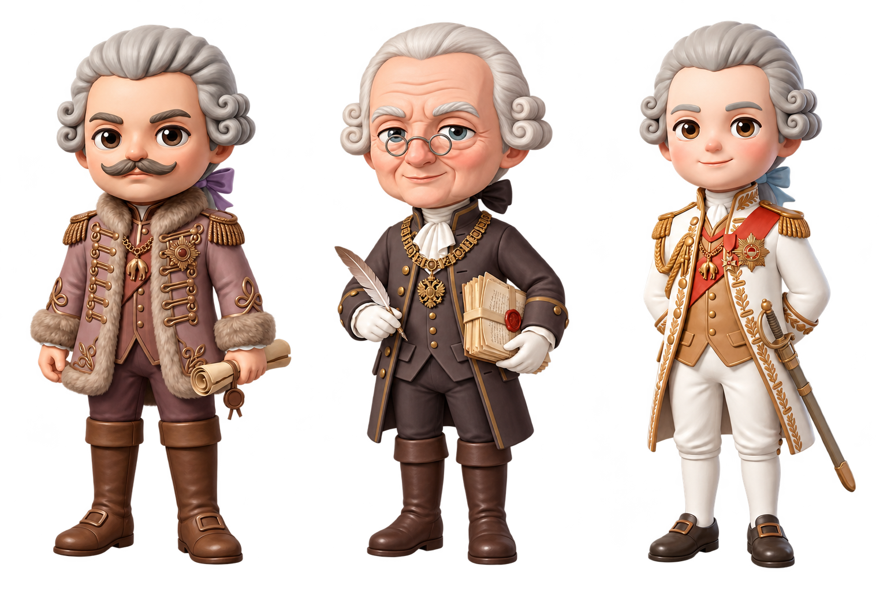

# Crown of Crisis

**Crown of Crisis** is a multilingual browser-based historical serious game about political decision-making under Emperor Joseph II in the Habsburg Monarchy between 1784 and 1790.

The game explores how political authority, implementation capacity, fiscal pressure, provincial resistance, military demands, and social burden interact over time.

> The player is not asked to solve history, but to govern within it.

## Play Online

**GitHub Pages:**  
https://yongshicc.github.io/crown-of-crisis/

The game is designed primarily for desktop browsers.

Languages:

- English
- German
- Simplified Chinese

## Historical Campaign

The campaign follows a fixed historical chronology:

1. **1784 Vienna — The Language Edict**
2. **1785 Pressburg — The Taxation Conflict**
3. **1787 Hungary — The Resistance of the Counties**
4. **1788–1789 Ottoman Frontier — War and Fiscal Crisis**
5. **1790 Vienna — The Final Crisis**

Historical events remain linear, while the political conditions in which later crises are encountered change according to earlier decisions.

## Core Design

Crown of Crisis focuses on three connected layers:

**Policy**  
The player chooses how Joseph II responds to a political crisis.

**Implementation**  
Issuing a decree does not guarantee that it can be successfully carried out. Administrative capacity, provincial cooperation, fiscal resources, and political resistance influence implementation.

**Consequence**  
Earlier decisions shape the conditions carried into later crises, producing different political trajectories and endings.

The central design principle is:

> **Events are historically linear, while consequences are systemically variable.**

The game therefore avoids presenting history as a sequence of simple correct or incorrect choices.

## Political Perspectives

The recurring political actors represent competing constraints on imperial rule:

- **Joseph II** — reform, central authority, and the question of what must be done
- **Hungarian Noble** — estates, inherited privileges, constitutional rights, and provincial autonomy
- **Chancellor** — administration, implementation capacity, fiscal limits, and the social cost of reform

Their disagreements are designed as political trade-offs rather than as a simple good-versus-bad system.

## Endings

The final outcome is determined by the accumulated political and administrative state of the monarchy rather than by a single final choice.

The game includes six non-ranked outcomes:

- Restored Monarchy
- Negotiated Monarchy
- Reforming State
- Reform Without Capacity
- Exhausted Monarchy
- Isolated Emperor

There is no total score and no single “best” ending.

## Historical Reflection

At the end of the campaign, the game reconstructs the player's political history through:

- **Review Your Reign**
- **How You Arrived Here**
- **Historical Reflection**

The purpose is to make cumulative causation visible without suggesting that the simulation represents a definitive reconstruction of historical causality.

The game concludes with:

> *History does not allow us to choose again. There are no perfect decisions, only choices made under uncertainty—and the consequences we carry forward.*

## Technical Information

- **Engine:** Godot 4
- **Platform:** Web / desktop browser
- **Renderer:** GL Compatibility
- **Languages:** EN / DE / zh_CN
- **Web build:** Godot HTML5 / WebAssembly
- **Deployment:** GitHub Pages

The repository currently contains the exported browser build used for online deployment.

## Project Context

Crown of Crisis was developed as a university serious-game project and as a research-through-design case study on historical learning.

The project investigates how a historical game can make the following concepts experientially understandable:

- uncertainty in political decision-making
- structural constraints
- policy versus implementation
- cumulative consequences
- historical contingency
- limited agency within a fixed chronology

## Research Question

> How can a web-based historical serious game make the uncertainty, structural constraints, and cumulative consequences of political decision-making experientially understandable through the case of Joseph II's Habsburg Monarchy?

## Status

**Final Web Build: PASS**

The complete 1784–1790 campaign has been exported and tested in a browser in English, German, and Simplified Chinese.
